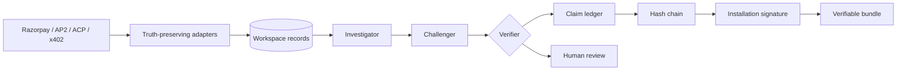

<p align="center">
  
</p>

<h1 align="center">Vera</h1>

<p align="center">
  <strong>The ledger that checks what your agents bought.</strong>
</p>

<p align="center">
  A self-hosted mandate claim ledger for Razorpay, AP2, ACP, and x402.<br />
  An investigator proposes. A verifier decides. A signed hash chain is the record.
</p>

<p align="center">
  
  
  
  
  
</p>

<p align="center">
  
</p>

When an AI agent buys under a mandate, the proof of what was authorized is scattered across mandate attestations, carts, receipts, processor settlements, and bank credits. Vera puts that trail back together, proves or flags every step, and keeps a signed record that a stranger can re-check.

An optional language model investigates. A deterministic verifier replays the evidence and re-derives every verdict from stored records. The model is useful; it is never trusted.

Vera is operated entirely through its web console and HTTP integration API. It has no product CLI and does not use `.env` files.

---

## Why this exists

<p align="center">
  
</p>

A bank statement cannot tell an agent apart from a person. Matching a payout to an order on amount and date can quietly accept an overspent mandate, a missing receipt, a retried double charge, or a lump that mixes several customers.

Vera closes seven typed claims per sale and preserves missing evidence as missing. Razorpay ingestion never invents mandates, receipts, settlements, bank credits, or signatures to make a close look complete.

## Run Vera

Requirements: Node.js 20 or newer and a persistent local filesystem.

```bash
npm install
npm test
npm run build
npm start
```

Open `http://127.0.0.1:43147/signup`. The first account is the installation owner. In Settings:

1. Set the canonical public URL used for webhook delivery and origin enforcement.
2. Connect Razorpay test credentials and a webhook secret.
3. Sync captured payments and the selected month’s official settlement recon.
4. Optionally connect Anthropic or an OpenAI-compatible model.
5. Enable live Razorpay keys only after deploying behind HTTPS and configuring backups.

Vera creates these files in `data/` on first use:

- `vera.db`: the SQLite system of record.
- `.master_key`: the installation trust root used to protect sessions, API-key hashes, provider credentials, and the audit signing identity.

Back up both files together. Never copy one without the other. Mount the entire `data/` directory as a persistent volume in containers.

### Docker Compose

```bash
docker compose up -d --build
```

The container runs as a non-root user with a read-only root filesystem, a writable `/tmp`, an HTTP health check, and a named volume at `/app/data`. Put port `43147` behind your HTTPS reverse proxy, create the owner account, and set the canonical public URL in Settings.

---

## How it works

<p align="center">
  
</p>

| | Role | What it does |
| --- | --- | --- |
| 1 | Investigator | A deterministic policy or configured model calls read tools, gathers evidence, and proposes a verdict. It cannot set claim status. |
| 2 | Challenger | Re-runs every cited tool and independently re-derives the decision. Unsupported or altered evidence is caught here. |
| 3 | Verifier | The only mutator. It commits a result only when the evidence, hashes, cited rows, and independent decision agree. Otherwise it abstains. |

The verifier is the trust boundary. Investigators, matchers, and anomaly proposers may use a language model. None of them can commit a result the verifier has not reproduced.



Full detail is in [docs/ARCHITECTURE.md](docs/ARCHITECTURE.md). See [docs/API.md](docs/API.md) for integration contracts and [docs/SECURITY.md](docs/SECURITY.md) for deployment controls.

## The seven checks

Every sale is proven, excepted, or explicitly abstained on seven fronts. Nothing is quietly dropped.

| Claim | Proven when | Representative exception |
| --- | --- | --- |
| **Authorized** | Intent attestation is present and valid; cart is within budget, category, and time | `MANDATE_ATTESTATION_MISSING`, `MANDATE_ATTESTATION_INVALID`, `MANDATE_OVERSPEND`, `MANDATE_EXPIRED` |
| **Cart bound** | Merchant attestation is present and valid, cart hash recomputes, line items total correctly, and payment equals the cart total | `CART_ATTESTATION_MISSING`, `CART_ATTESTATION_INVALID`, `CART_PAYMENT_MISMATCH` |
| **Receipted** | A durable receipt exists for the captured payment | `RECEIPT_ABSENT` |
| **Idempotent** | Exactly one payment exists per idempotency key | `RETRY_DOUBLE_BOOK` |
| **Settled** | A real settlement exists and gross − fees − tax equals net | `SETTLEMENT_ABSENT`, `SETTLEMENT_DRIFT` |
| **Banked** | A real bank credit reconciles to settlement units | `BANK_CREDIT_ABSENT`, `CHANNEL_UNTAGGED` |
| **Refund policy** | Refunds carry mandate provenance and do not collide | `ORPHAN_REFUND`, `DOUBLE_REFUND` |

All money is integer paise. Floating-point amounts never enter the canonical ledger.

## Web console

- `/app`: ingest JSON records, run a close, and inspect every claim.
- `/app/analysis`: deterministic and model-proposed reconciliation, real-data selective-risk calibration, cross-sale anomaly detection, and per-sale AI investigation.
- `/app/review`: acknowledge exceptions without rewriting verifier output.
- `/app/closes`: close history, audit-bundle download, trusted verification, and installation public-key export.
- `/app/pay`: Razorpay Checkout test flow.
- `/app/settings`: installation, AI, integration API-key, and Razorpay configuration.

There are no seeded or fixture-backed runtime pages. Fixtures remain test-only and never enter the product database.

## Trust boundary

An investigator may gather evidence and propose a result. Vera then replays cited tools, challenges inconsistencies, and independently re-derives the decision. Only the verifier can commit `PROVEN`, `EXCEPTED`, or `ABSTAINED`.

Each installation owns one persistent Ed25519 signing identity. Audit bundles contain the complete canonical world, committed claims, event hash chain, signature, and public key. The web verifier additionally checks that the bundle signer matches the installation public key.

## Integration API

Create an integration API key in Settings and send it as `Authorization: Bearer vera_…`. See [docs/API.md](docs/API.md).

## Development

```bash
npm test
npm run lint
npm run build
```

Synthetic fixtures, answer keys, and conformal calibration datasets exist only in the automated test suite. Production analysis always starts from records belonging to the authenticated workspace.

## License

MIT. See [LICENSE](LICENSE).
