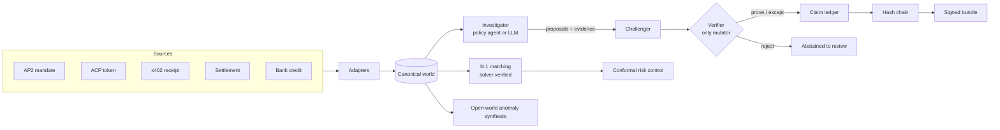

<p align="center">
  
</p>

<h1 align="center">Vera</h1>

<p align="center">
  <strong>The ledger that checks what your agents bought.</strong>
</p>

<p align="center">
  A mandate claim ledger for AP2, ACP, and x402.<br />
  An AI investigates. A verifier decides. A signed hash chain is the record.
</p>

<p align="center">
  
  
  
  
</p>

<p align="center">
  
</p>

When an AI agent buys under a mandate, the money lands like any ordinary card payout. The proof of what was authorized is scattered across an AP2 mandate, an ACP token, an x402 receipt, a processor settlement, and a bank credit. Vera puts that trail back together, proves or flags every step, and keeps a signed record that a stranger can re-check.

A language model does the investigating. A deterministic verifier re-derives every verdict from the raw rows. A wrong or invented answer is rejected instead of booked. The model is useful; it is never trusted.

- Live console: [`/ledger`](src/app/ledger/page.tsx) runs a full close in the browser.
- Command line: `npm run mandate` exposes every stage.
- HTTP API: `/api/investigate`, `/api/reconcile`, `/api/anomaly`, `/api/ledger`.

---

## Why this exists

<p align="center">
  
</p>

A bank statement cannot tell an agent apart from a person. Both land as a payout. Matching a payout to an order on amount and date, the way most reconciliation still works, quietly accepts an overspent mandate, a missing receipt, a retried double charge, or a lump that mixes several customers.

Those are the cases that cost a finance team real money, and they are exactly the ones a plain join misses. On seed 42, a naive amount-and-date match misses **26 of 28** planted faults. Vera catches all 28, with zero false proves.

Vera treats each agent sale as seven typed claims and closes the books only when each claim is proven or explicitly flagged. On top of that it adds three capabilities a rule engine alone cannot provide: combinatorial matching for lumped payouts, a calibrated accept-or-abstain rule with a guaranteed error bound, and open-world detection of patterns that no fixed rule describes.

---

## How it works

<p align="center">
  
</p>

| | Role | What it does |
| --- | --- | --- |
| 1 | Investigator | A policy agent or a live model calls read tools, gathers evidence, and proposes a verdict. It cannot set claim status. |
| 2 | Challenger | Re-runs every cited tool from scratch and re-derives the decision. Tampering or a lying proposal is caught here. |
| 3 | Verifier | The only mutator. Commits **PROVEN** or **EXCEPTED** only when the evidence is in the transcript, hashes match a fresh tool run, cited rows exist, no challenge is open, and an independent audit agrees. Otherwise the claim is **ABSTAINED**. |

The verifier is the trust boundary. The investigator, the matcher, and the anomaly proposer can all be a language model. None of them can commit a result the verifier has not independently reproduced.



Full detail, with sequence and data-model diagrams, is in [docs/ARCHITECTURE.md](docs/ARCHITECTURE.md). The engine reference is in [src/mandate/README.md](src/mandate/README.md).

---

## The seven checks

Every sale is proven or flagged on seven fronts. Nothing is quietly dropped.

| Claim | Proven when | Exception |
| --- | --- | --- |
| **Authorized** | Intent signature valid; cart within budget, category, and time | `MANDATE_OVERSPEND`, `MANDATE_EXPIRED` |
| **Cart bound** | Merchant signature valid, cart hash recomputes, payment equals cart total | `CART_PAYMENT_MISMATCH` |
| **Receipted** | A stored receipt exists | `RECEIPT_ABSENT` |
| **Idempotent** | One payment per idempotency key | `RETRY_DOUBLE_BOOK` |
| **Settled** | Settlement net equals payment amount | `SETTLEMENT_DRIFT` |
| **Banked** | Exactly one bank credit tagged to the intent | `CHANNEL_UNTAGGED` |
| **Refund policy** | Refunds carry a mandate reference and do not collide | `ORPHAN_REFUND`, `DOUBLE_REFUND` |

All money is integer paise. There are no floating-point amounts anywhere in the ledger.

## Three layers beyond the claims

1. **Combinatorial matching.** Real payouts are lumped, so one bank credit is the sum of several settlements within a tolerance. An exact subset-sum solver enumerates and checks groupings. The model proposes groupings from amounts, dates, and counterparty hints; the solver confirms them. One planted group is larger than the solver's search cap, so only the model recovers it.
2. **Conformal risk control.** A fallible matcher produces a confidence score. Split-conformal calibration picks an acceptance threshold whose upper bound on the accepted-error rate stays at or below a target, then abstains on the rest and sends them to a human. The output is a match rate with a stated guarantee rather than a self-reported number.
3. **Open-world anomaly synthesis.** Some risks are patterns across many clean sales, such as one agent splitting spend into several carts just under its cap within a short window. A proposer writes a rule in a small, safe language; the rule is executed and checked for coverage and coherence; accepted findings go to human review and are never actioned automatically.

Every lookup and verdict is hash-chained, so any edit or deletion is detectable. The chain is signed and packed into a bundle. A stranger recomputes the chain, checks the signature, and replays the whole close.

```bash
npm run mandate bundle
npm run mandate verify-bundle    # RESULT: VERIFIED
```

---

## Quick start

```bash
npm install
npm test                 # engine tests
npm run mandate:eval     # score against the answer key
npm run build
npm start                # production, http://127.0.0.1:43147
```

For local iteration, `npm run dev` is the same port. Optional: connect a model to enable the live investigator.

```bash
cp .env.example .env.local     # add ANTHROPIC_API_KEY or OPENAI_API_KEY
```

Without a key, the deterministic close, the matcher, the risk control, and the anomaly discovery all run, and the test suite passes. Only the live model panels need a key. Keys are read from the environment only; nothing secret is committed.

## Command line

```bash
npm run mandate close             # run the deterministic close on a seeded week
npm run mandate eval              # score against the answer key, exit non-zero on failure
npm run mandate show --sale sale_000
npm run mandate ingest            # close the AP2, ACP, and x402 example records
npm run mandate match             # N:1 reconciliation, solver verified
npm run mandate match --llm       # model-guided matching
npm run mandate risk              # conformal risk-controlled match rate
npm run mandate anomaly           # open-world anomaly discovery
npm run mandate anomaly --llm     # model proposes an anomaly rule, then it is validated
npm run mandate bundle            # export a signed, hash-chained evidence bundle
npm run mandate verify-bundle     # re-check a bundle: chain, signature, and replay
```

## HTTP API

| Route | Method | Purpose |
| --- | --- | --- |
| `/api/ledger` | GET | Snapshot of a full close as JSON |
| `/api/investigate` | POST | Model investigates one sale; the verifier commits or overrides |
| `/api/reconcile` | POST | N:1 matching, deterministic or model-guided |
| `/api/anomaly` | POST | Open-world anomaly discovery or a model proposal |

The POST routes accept `{ "seed": 42, "llm": true }`. The `llm` flag uses the configured model when a key is present.

## Configuration

| Variable | Meaning |
| --- | --- |
| `ANTHROPIC_API_KEY` | Enables the Claude model (preferred when set) |
| `ANTHROPIC_MODEL` | Model id, default `claude-sonnet-5` |
| `OPENAI_API_KEY` | Enables an OpenAI-compatible endpoint |
| `OPENAI_MODEL` | Model id, default `gpt-4o-mini` |
| `OPENAI_BASE_URL` | Override for a compatible gateway |

See `.env.example`.

## Project structure

```
src/
  app/            Next.js routes: /, /ledger, and the /api endpoints
  components/     UI (shadcn/ui on Base UI)
  lib/            server helpers that read the engine for the pages
  mandate/        the engine, with no framework dependencies
    fixture.ts        seeded synthetic books and the answer key
    tools.ts          pure read tools over the world
    decide.ts         the auditor logic used by the verifier
    verifier.ts       the only component that can commit a claim
    closer.ts         deterministic policy investigator
    agent.ts          model investigator (tool-use loop)
    challenger.ts     independent adversary
    orchestrate.ts    wiring and finalization
    conformal.ts      Clopper-Pearson selective prediction
    anomaly.ts        safe rule language, discovery, and validation
    matching/         subset-sum solver, reconcilers, risk control
    audit.ts          hash chain and ed25519 signing
    bundle.ts         export and offline verification
    cli.ts            command line entry point
public/art/       mascot, hero, pipeline, and icon used on the site
docs/
  ARCHITECTURE.md  diagrams and the reasoning behind the design
```

## Testing

```bash
npm test            # engine tests
npm run lint        # eslint
npm run build       # production build
```

The suite covers the fixture and answer key, each tool, the verifier's accept and reject paths, the model loop with scripted stand-ins, the subset-sum solver and its verifier, the conformal guarantee, and the anomaly discovery and validation.

Eval gates on seed 42: at least 50 claims processed, ≥95% sale-claim closure, 100% planted-fault recall, and zero false proves. The eval also passes on seeds 1, 7, 42, 100, and 2026.

## References

The design draws on public work rather than inventing terms:

- Agent Payments Protocol (AP2), the Agentic Commerce Protocol (ACP), and x402 for the mandate, cart, and settlement objects.
- The Subset-Sum Matching Problem for lumped reconciliation.
- Split-conformal selective prediction for the accept-or-abstain guarantee.
- Neuro-symbolic verification, where a model proposes and a checker decides.

## License

MIT. See [LICENSE](LICENSE). Copyright 2026 afnanksalal.
