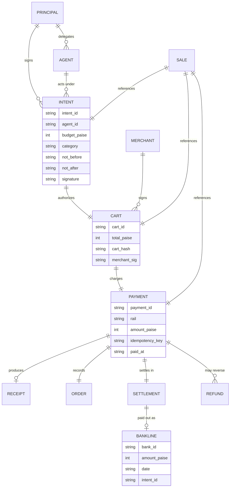
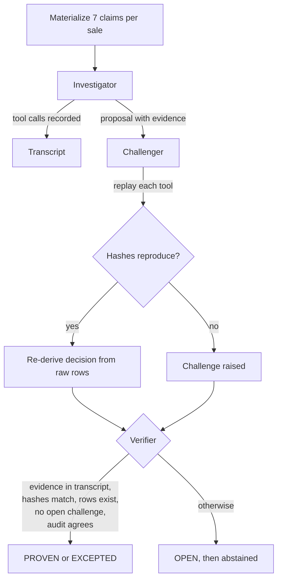
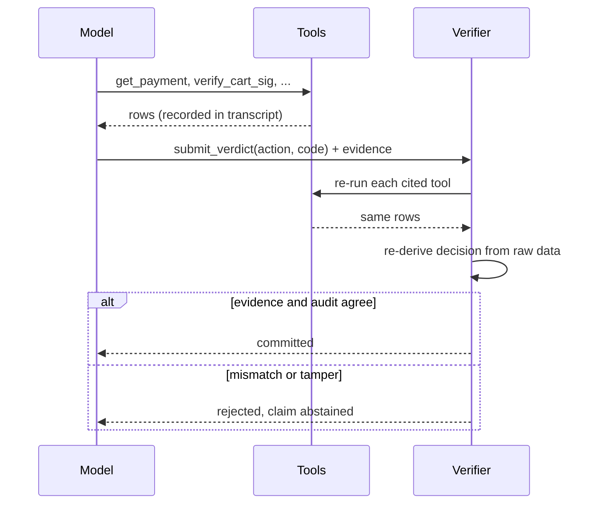
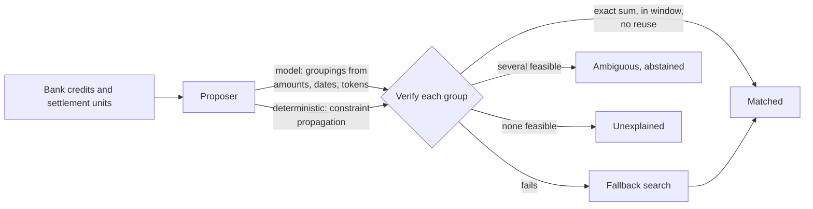
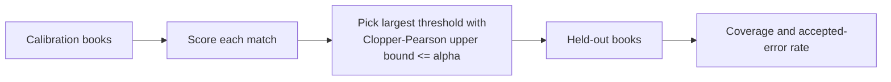
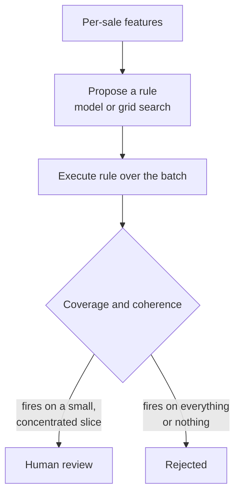

# Architecture

This document explains how Vera is put together and why. It assumes you have read the project README.

## The problem, stated precisely

A human card sale joins cleanly: an order id, a payment id, and a settlement id line up, and a bank credit closes the loop. An agent sale does not. The authorization sits in a mandate, the basket in a merchant-signed cart, the money in a token or an on-chain transfer, and the payout in a lump that a bank narrates with its own reference. No single key runs through all of it. Reconciling on amount and date alone accepts several kinds of loss without noticing them.

Vera reframes a sale as a set of typed claims and closes the books only when each claim is either proven with evidence or flagged as an exception. A language model gathers evidence and proposes verdicts. A deterministic verifier re-derives each verdict from the raw rows and is the only component allowed to record a result.

## Data model

All money is stored as integer paise. There are no floating point amounts anywhere in the ledger.

## The seven claims

For every sale, Vera resolves seven claims.

| Claim | Proven when | Exception |
| --- | --- | --- |
| Authorized | Intent signature valid; cart within budget, category, and time | `MANDATE_OVERSPEND`, `MANDATE_EXPIRED` |
| Cart bound | Merchant signature valid, cart hash recomputes, payment equals cart total | `CART_PAYMENT_MISMATCH` |
| Receipted | A stored receipt exists | `RECEIPT_ABSENT` |
| Idempotent | One payment per idempotency key | `RETRY_DOUBLE_BOOK` |
| Settled | Settlement net equals payment amount | `SETTLEMENT_DRIFT` |
| Banked | Exactly one bank credit tagged to the intent | `CHANNEL_UNTAGGED` |
| Refund policy | Refunds carry a mandate reference and do not collide | `ORPHAN_REFUND`, `DOUBLE_REFUND` |

## The close pipeline

The verifier accepts a proposal only when the evidence appears in the run transcript, each cited tool re-runs to the same hash, every cited row exists, no challenge is open, and an independent re-derivation agrees on the action and code. A proposal that lies about a fault is rejected, and the claim is abstained rather than booked.

## Investigator, live model version

The model reasons and chooses tools. It cannot set a claim's status. Swapping the deterministic investigator for the model changes who proposes, not who decides.

## Combinatorial matching

Lumped payouts make reconciliation a subset-sum problem: one bank credit equals a sum of settlements within a tolerance, and each settlement belongs to at most one credit.

The fixture includes a group with more members than the deterministic search cap, so the deterministic pass reports it as unexplained while the model recovers it and the solver confirms the exact sum. This is a concrete case where the model earns its place without being trusted.

## Conformal risk control

A deliberately fallible matcher assigns each credit a confidence score. Split-conformal calibration turns that score into an accept-or-abstain rule with a stated guarantee.

The reported match rate then carries a bound: among accepted matches, the error stays at or below the target with high probability, and the remainder is sent to a person.

## Open-world anomaly synthesis

Some risks are patterns across sales that individually pass every claim. One example is limit evasion: an agent splits spend into several carts, each just under its cap, within a short window.

Rules are expressed in a small language with a fixed set of fields and operators, so nothing arbitrary executes. A rule that flags the whole batch is rejected. Accepted findings are routed to a person and never actioned on their own.

## Tamper-evident record

Every tool call and every verdict is appended to a hash chain, where each entry commits to the one before it. The chain head is signed with an ed25519 key and packaged with the world and the committed claims into a bundle. A third party recomputes the chain, checks the signature against the included public key, confirms the world hash, and replays the close. Any edit, reorder, or deletion is detected.

## Determinism and testing

The fixture is generated from a seed, and the answer key is derived at generation time, not by running the system against itself. The verifier reads the same raw data an auditor would. Tests cover the fixture, each tool, both verifier paths, the model loop with scripted stand-ins, the solver and its checker, the conformal guarantee on held-out data, and anomaly discovery and validation.
