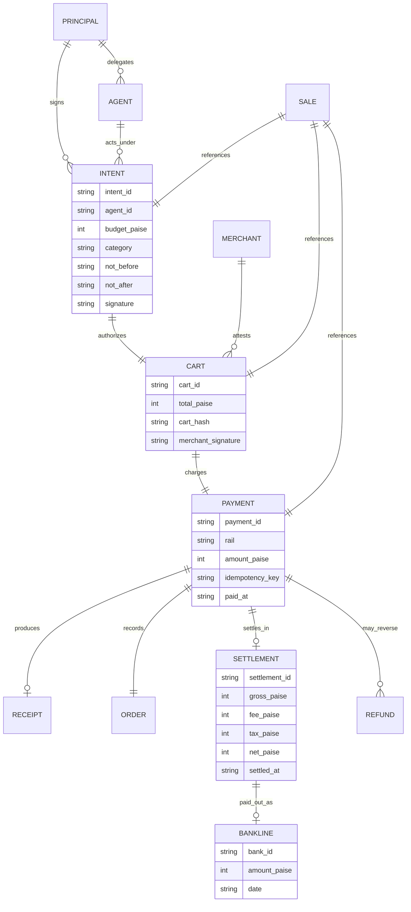
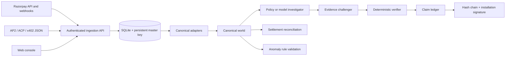
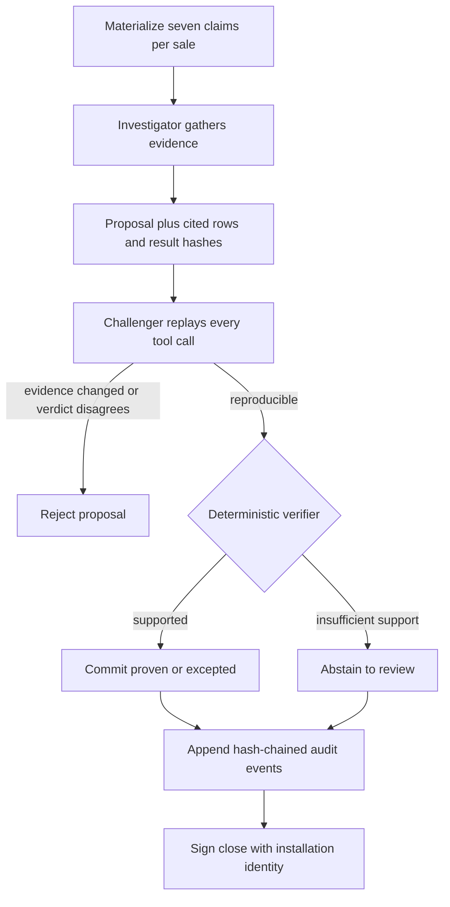
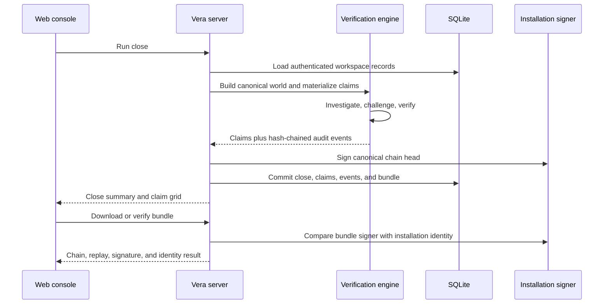

# Architecture

Vera is one self-hosted Next.js application with a framework-independent verification engine and SQLite persistence.

## The problem, stated precisely

A human card sale often has an order, payment, and settlement identifier that can be joined directly. An agent sale distributes authorization and evidence across a principal mandate, agent identity, signed cart, payment rail, receipt, processor settlement, and bank narration. No single trustworthy key necessarily runs through all of it.

Vera reframes every sale as seven typed claims. A claim is committed only when its evidence can be reproduced from persisted workspace records. Amount-and-date similarity may propose a relationship, but it cannot prove authorization, receipt durability, idempotency, or settlement provenance.

## Canonical data model



Money is stored as integer paise. Protocol adapters preserve absence: a missing mandate attestation, receipt, settlement, or bank credit remains absent in the canonical world.



## Runtime boundaries

- `src/app`: authenticated web UI and HTTP routes.
- `src/server`: persistence, credentials, policy, Razorpay, analysis orchestration, and installation signing identity.
- `src/mandate`: pure canonicalization, evidence tools, investigation, challenge, verification, reconciliation, anomaly validation, and bundles.

Runtime code never constructs generated fixtures. Synthetic worlds and calibration datasets are test-only. Razorpay settlement sync consumes the official monthly recon response and preserves its gross, fee, tax, net credit, settlement ID, and UTR. The UTR remains processor provenance; it is not promoted into bank-statement evidence.

## Canonical close

Every ingested protocol record is normalized to principals, agents, intents, carts, payments, receipts, orders, settlements, bank lines, refunds, and sales. A close materializes seven claims for every sale:

1. `AUTHORIZED`
2. `CART_BOUND`
3. `RECEIPTED`
4. `IDEMPOTENT`
5. `SETTLED`
6. `BANKED`
7. `REFUND_POLICY`

The investigator can only propose. The challenger replays cited tool calls. The verifier checks transcript membership, result hashes, cited row existence, open challenges, and an independent decision before committing.



### Why three roles exist

- The investigator optimizes for finding relevant evidence and may be probabilistic.
- The challenger catches altered transcripts, stale tool output, missing cited rows, and proposals that disagree with a fresh decision.
- The verifier is deliberately narrow and deterministic. It is the only component allowed to mutate claim state.

This separation permits model-assisted investigation without treating generated text as financial evidence.

## Reconciliation and anomalies

Settlement-to-bank reconciliation is a subset-sum problem. The deterministic path commits only unique feasible assignments and abstains on ambiguity. An optional model may propose semantic groupings using narration tokens, but `verifyAssignment` enforces exact sums, date windows, known identifiers, and no settlement reuse.

Cross-sale anomaly rules execute in a constrained DSL. Rules must fire on a sufficiently small and coherent group before they are routed to human review. Model-authored rules receive the same deterministic validation as built-in discovery.

Selective risk control is enabled only from labelled historical match outcomes imported by the operator. Vera calibrates a threshold and Clopper–Pearson upper error bound from those production labels. Without labels the console explicitly withholds a guarantee; synthetic calibration data is never substituted at runtime.

## Persistence and configuration

Configuration belongs to the database and is edited in `/app/settings`. Secrets are encrypted with the installation master key. The master key itself is generated once in the persistent `data/` directory, outside the database to avoid storing ciphertext and its wrapping key together.

Each installation generates one Ed25519 audit identity. Its private key is encrypted in SQLite; its public key can be exported from the web console. A bundle is trusted only when its internal checks pass and its signer equals the installation identity.

```mermaid
flowchart LR
  OWNER[Installation owner] --> SETTINGS[/app/settings]
  SETTINGS --> VALIDATE[Server-side validation]
  VALIDATE --> ENC[Envelope encryption]
  ENC --> DB[(SQLite settings)]
  MASTER[data/.master_key] --> ENC
  MASTER --> SESSION[Session signing and API-key pepper]
  MASTER --> IDENTITY[Encrypted Ed25519 private key]
```

The database and master key form one backup unit. Restoring only the database preserves ciphertext but not the ability to decrypt it. Restoring only the key preserves no application state.

## Request and trust boundaries

| Boundary | Control |
| --- | --- |
| Browser session | HttpOnly, SameSite cookies; HTTPS-aware Secure flag; CSRF origin enforcement |
| Integration API | Hashed bearer API keys scoped to a workspace |
| Razorpay webhook | Per-workspace HMAC verification before ingestion |
| Stored provider credentials | Encrypted with the installation master key |
| Workspace data | Every query and mutation is scoped by authenticated user id |
| Model output | Proposal only; deterministic replay and verification before mutation |
| Evidence bundle | Canonical hashes, event-chain verification, replay, signature, and trusted signer match |

## Close and bundle sequence



## Deployment

Use one Node.js process per SQLite database, a persistent local volume for `data/`, and an HTTPS reverse proxy. Horizontal application replicas require replacing SQLite with a transactional shared database and are outside the current deployment contract.
